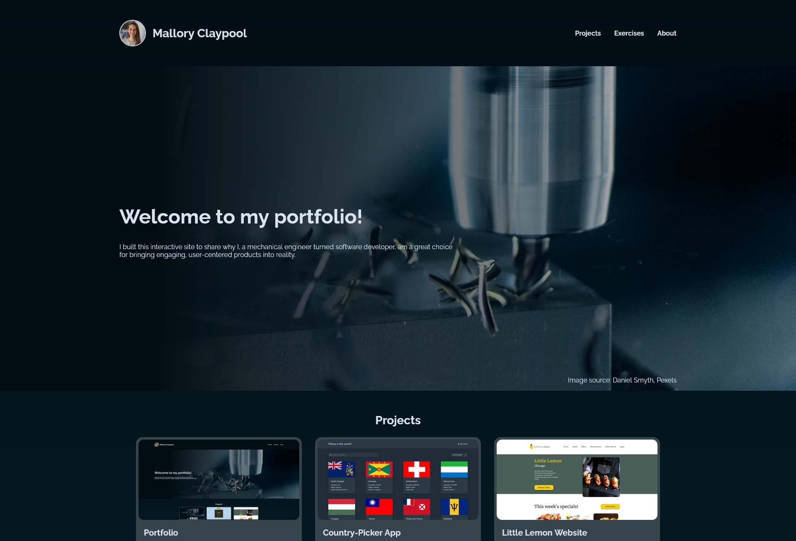
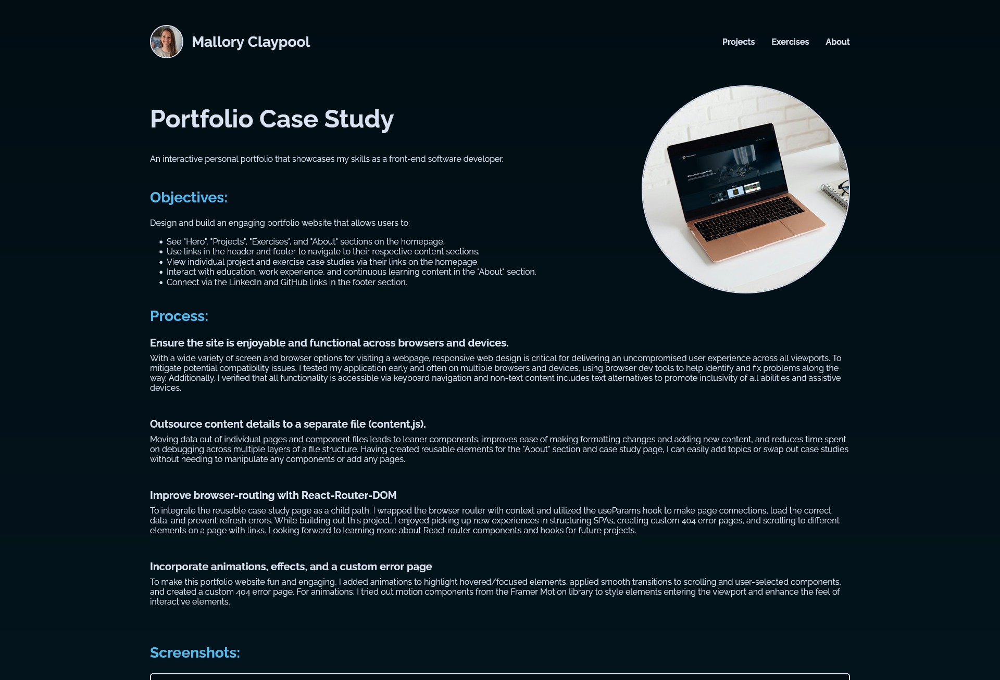

# Personal Portfolio
 Front-End Developer Portfolio Project

## Table of contents

- [Overview](#overview)
  - [The challenge](#the-challenge)
  - [Built with](#built-with)
  - [Live Link](#live-link)
  - [Screenshots](#screenshot)

## Overview

### The challenge

Users should be able to:

- See "Hero", "Projects", "Exercises", and "About" sections on the homepage.
- Use links in the header and footer to navigate to their respective content sections.
- View individual project and exercise case studies via their links on the homepage.
- Interact with education, work experience, and continuous learning content in the "About" section.
- Connect via the LinkedIn and GitHub links in the footer section.

### Built with

- Semantic HTML5 markup
- CSS custom properties
- Flexbox
- Mobile-first workflow
- [React](https://reactjs.org/) - JS library
- [Tailwind CSS](https://tailwindcss.com/) - For styles

### Live Link
- Live Site URL: [Personal Portfolio](https://mjclaypool.github.io/Personal-Portfolio/)

### Screenshots

